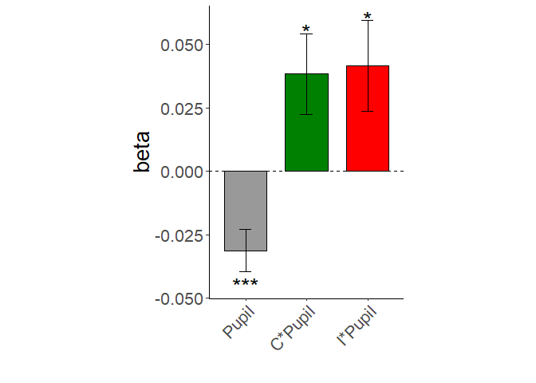
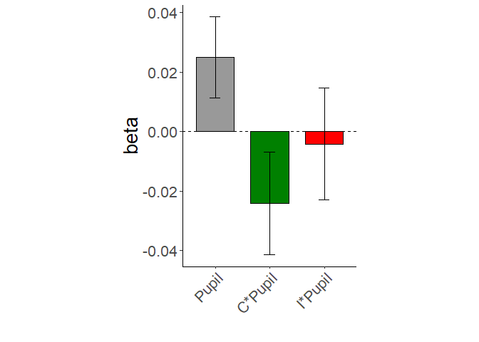

Stroop Cognitive Modeling - Behavioral Analysis
================
JT
10-02-2022

## Introduction

This script contains the analysis for the behavioral data of a Stroop
task. The participant had to respond to the color of the stimulus,
whilst ignoring the word. The stimuli consisted of either BLUE, RED,
GREEN or XXXXX in blue, red or green color. During the experiment we
recorded their reaction time as well as their pupil size.

## Data file

In the data file, the columns represent the following:

– ‘pupil’ is the average pupil size 500ms before stimulus onset

– pupil_d1 is the change in pupil size between the last two pupil
samples before stimulus onset

– ‘crep’ and ‘wrep’ are colour/word repetitions

– ‘repalt’ is the ‘feature integration’ variable in Notebaert & Verguts:
1 = complete repetition or alternation, 0 = partial repetition

– ‘cae’ is the ‘conflict adaptation’ variable in Notebaert & Verguts: 1
= when congruency status in repeated (e.g. incong followed by incong;
cong followed by cong), 0 = when congruency status changes

All regressors have already been normalized (log and then z-score for
RT; mean-centered for everything else). The ‘pupil’ and ‘pupil_d1’
regressors were first z-scored before concatenating across blocks, for a
given participant. This is done to further eliminate slow between-block
fluctuations.

## Script

First, we load the packages and data and make some minor additions for
further processing.

``` r
#load packages
library(tidyverse) # data wrangling
library(ggplot2) # plotting the data
library(plyr) # for use of summarise() function
library(dplyr) #for group_by(), inner_join(), mutate()
library(lme4) # mixed models statistical analysis
library(viridis)

#Load the data. data = pupil is z-scored per participant, data_der = pupil is z-scored per block
data <- read.csv('ZwbBASE_gazeREJ_yes_no_yes.csv', sep = ",")

# Make nSubject column with fix to 2 characters, and add to data frame 
nSubject <- sprintf("%02d",as.numeric(data$nSubj)) 
data <- cbind(nSubject, data)

# Change subject column to variable
data$nSubject <- as.character(data$nSubject)

# Make column in dataframe with trialtype
data$trialtype<-ifelse(data$cong>0 & data$incong<0,'congruent',
        ifelse(data$incong>0 & data$cong<0,'incongruent', 'neutral'
        ))
```

## Statistical analysis using pupil derivative

Then we fit a linear model for each subject, using the pupil derivative
as proxy for neural gain. After fitting a linear model for each subject,
we bind all results together, conduct a t-test per variable (but we are
only interested in the variables pupil_d1, cong x pupil_d1 and incong x
pupil_d1) and store the results.

``` r
# Fit a linear model for each subject
fits <- lmList(RT ~ 1 + cong + incong + pupil_d1 + cong*pupil_d1 + incong*pupil_d1 + crep + wrep + repalt + cae + ntrial | nSubject, data=data)

# Extract coefficients out of lm Class dataframe to normal dataframe
df_fits <- bind_rows(as.data.frame(coef(fits)))

# Do a t-test for each column
results <- lapply(df_fits, t.test)

# Bind results in a matrix
resultsmatrix <- do.call(cbind, results)

# Print out results in a table
table <- resultsmatrix[c("statistic","estimate","p.value", "conf.int"),]
confint_pupil <- table[["conf.int", "pupil_d1"]]

df_stats <- df_fits %>% 
  summarise_all(list(mean = ~mean(.), sd = ~sd(.), se = ~sd(.x)/sqrt(length(.x))))

table
```

    ##           (Intercept) cong         incong       pupil_d1     crep        
    ## statistic -2.700223   -4.494621    8.317409     -3.775146    -10.83673   
    ## estimate  -0.06620553 -0.1219346   0.2708547    -0.03130663  -0.563578   
    ## p.value   0.01181526  0.0001183845 6.308518e-09 0.0007998212 2.463961e-11
    ## conf.int  numeric,2   numeric,2    numeric,2    numeric,2    numeric,2   
    ##           wrep        repalt      cae         ntrial      cong:pupil_d1
    ## statistic -2.356788   -1.835489   -0.5864936  2.740078    2.410067     
    ## estimate  -0.04785214 -0.04253614 -0.01203815 0.001063778 0.03837743   
    ## p.value   0.02594196  0.07747158  0.5624157   0.01075371  0.02303347   
    ## conf.int  numeric,2   numeric,2   numeric,2   numeric,2   numeric,2    
    ##           incong:pupil_d1
    ## statistic 2.311359       
    ## estimate  0.04147365     
    ## p.value   0.02868265     
    ## conf.int  numeric,2

To visualize the results of our variables of interest, we visualize the
beta-weights and SEM in a bar plot. Asteriskes denote signifance levels
(\* -> p \< 0.05, \*\*\* -> p \< 0.01).

## Visualization of beta-weight results per condition for pupil derivative

``` r
# Extract relevant t-scores out table for barplot
beta_score_pupil <- df_stats[1, 'pupil_d1_mean']
sem_pupil <- df_stats[1, 'pupil_d1_se']

beta_score_pupilcong <- df_stats[1, 'cong:pupil_d1_mean']
sem_pupilcong <- df_stats[1, 'cong:pupil_d1_se']

beta_score_pupilincong <- df_stats[1, 'incong:pupil_d1_mean']
sem_pupilincong <- df_stats[1, 'incong:pupil_d1_se']

# Make columns for dataframe
beta_score <- c(beta_score_pupil, beta_score_pupilcong, beta_score_pupilincong)
sem <- c(sem_pupil, sem_pupilcong, sem_pupilincong)
condition <- c("Pupil", "C*Pupil", "I*Pupil")

# Make dataframe from condition and t-score
df <- data.frame(condition, beta_score, sem)

# Define factor levels so that the order of factors will be Pupil - C*Pupil - I*Pupil
df$condition <- factor(df$condition, levels = c("Pupil", "C*Pupil", "I*Pupil"))

# Make bar plot
p<-ggplot(data=df, aes(x=condition, y=beta_score, fill=condition)) + 
  geom_bar(stat="identity", color="black", width=0.7)+ # Define barplot visuals
  geom_errorbar(aes(ymin=beta_score-sem, ymax=beta_score+sem), width=.2, position=position_dodge(.9)) +
  scale_fill_manual(values=c("#999999", "#008000", "#FF0000"))+ # Fill colour of bar plots
  theme_classic() + # Theme of barplot
  theme(aspect.ratio = 3/2) + # Change ratio so graph becomes smaller
  #ylim(-4, 4) + # Define the limits of the y-axis
  geom_hline(yintercept=0, linetype="dashed") + # Add 0-intercept line
  theme(legend.position = "none") + # Remove legend
  xlab("") + ylab("beta") +  # Change x and y axis labels
  theme(text = element_text(size=20),
        axis.text.x = element_text(angle=45, hjust=1)) + # Make xticks bigger and rotate with 45 degrees
  annotate("text", size=7, x = 1, y = -0.045, label = "***") + 
  annotate("text", size=7, x = 2, y = 0.055, label = "*") + 
  annotate("text", size=7, x = 3, y = 0.06, label = "*") 
  
p
```

<!-- -->

## Statistical analysis using pupil base

Now we do the same as above, but then using baseline pupil as our proxy
for neural gain. After fitting a linear model for each subject, we bind
all results together, conduct a t-test per variable (but we are only
interested in the variables pupil, cong x pupil and incong x pupil) and
store the results.

``` r
# Fit a linear model for each subject
fits2 <- lmList(RT ~ 1 + cong + incong + pupil + cong*pupil + incong*pupil + crep + wrep + repalt + cae + ntrial | nSubject, data=data)

# Extract coefficients out of lm Class dataframe to normal dataframe
df_fits2 <- bind_rows(as.data.frame(coef(fits2)))

# Do a t-test for each column
results2 <- lapply(df_fits2, t.test)

# Bind results in a matrix
resultsmatrix2 <- do.call(cbind, results2)

# Print out results in a table
table2 <- resultsmatrix2[c("statistic","estimate","p.value", "conf.int"),]
confint_pupil2 <- table2[["conf.int", "pupil"]]

df_stats2 <- df_fits2 %>% 
  summarise_all(list(mean2 = ~mean(.), sd2 = ~sd(.), se2 = ~sd(.x)/sqrt(length(.x))))

table2
```

    ##           (Intercept) cong         incong       pupil      crep        
    ## statistic -3.35296    -4.514654    8.289223     1.842287   -10.95548   
    ## estimate  -0.08293804 -0.1210548   0.2731683    0.02492362 -0.5634849  
    ## p.value   0.002378866 0.0001121929 6.743833e-09 0.07644145 1.935147e-11
    ## conf.int  numeric,2   numeric,2    numeric,2    numeric,2  numeric,2   
    ##           wrep        repalt      cae         ntrial      cong:pupil 
    ## statistic -2.54079    -1.893862   -0.6506415  3.386563    -1.404737  
    ## estimate  -0.04922522 -0.04165182 -0.01310624 0.001313179 -0.02414466
    ## p.value   0.01711965  0.06900418  0.5207768   0.002183907 0.1715002  
    ## conf.int  numeric,2   numeric,2   numeric,2   numeric,2   numeric,2  
    ##           incong:pupil
    ## statistic -0.2214331  
    ## estimate  -0.004154822
    ## p.value   0.8264214   
    ## conf.int  numeric,2

## Visualization of beta-weight results per condition for pupil base

To visualize the results of our variables of interest, we visualize the
beta-weights and SEM in a bar plot. All variables were non-significant.

``` r
# Extract relevant t-scores out table for barplot
beta_score_pupil2 <- df_stats2[1, 'pupil_mean2']
sem_pupil2 <- df_stats2[1, 'pupil_se2']

beta_score_pupilcong2 <- df_stats2[1, 'cong:pupil_mean2']
sem_pupilcong2 <- df_stats2[1, 'cong:pupil_se2']

beta_score_pupilincong2 <- df_stats2[1, 'incong:pupil_mean2']
sem_pupilincong2 <- df_stats2[1, 'incong:pupil_se2']

# Make columns for dataframe
beta_score2 <- c(beta_score_pupil2, beta_score_pupilcong2, beta_score_pupilincong2)
sem2 <- c(sem_pupil2, sem_pupilcong2, sem_pupilincong2)
condition2 <- c("Pupil", "C*Pupil", "I*Pupil")

# Make dataframe from condition and t-score
df2 <- data.frame(condition2, beta_score2, sem2)

# Define factor levels so that the order of factors will be Pupil - C*Pupil - I*Pupil
df2$condition2 <- factor(df2$condition2, levels = c("Pupil", "C*Pupil", "I*Pupil"))

# Make bar plot
p<-ggplot(data=df2, aes(x=condition2, y=beta_score2, fill=condition2)) + 
  geom_bar(stat="identity", color="black", width=0.7)+ # Define barplot visuals
  geom_errorbar(aes(ymin=beta_score2-sem2, ymax=beta_score2+sem2), width=.2, position=position_dodge(.9)) +
  scale_fill_manual(values=c("#999999", "#008000", "#FF0000"))+ # Fill colour of bar plots
  theme_classic() + # Theme of barplot
  theme(aspect.ratio = 3/2) + # Change ratio so graph becomes smaller
  #ylim(-4, 4) + # Define the limits of the y-axis
  geom_hline(yintercept=0, linetype="dashed") + # Add 0-intercept line
  theme(legend.position = "none") + # Remove legend
  xlab("") + ylab("beta") +  # Change x and y axis labels
  theme(text = element_text(size=20),
        axis.text.x = element_text(angle=45, hjust=1)) # Make xticks bigger and rotate with 45 degrees

p
```

<!-- -->

## Citations

``` r
library(report)
cite_packages()
```

    ##   - Douglas Bates and Martin Maechler (2021). Matrix: Sparse and Dense Matrix Classes and Methods. R package version 1.3-4. https://CRAN.R-project.org/package=Matrix
    ##   - Douglas Bates, Martin Maechler, Ben Bolker, Steve Walker (2015). Fitting Linear Mixed-Effects Models Using lme4. Journal of Statistical Software, 67(1), 1-48. doi:10.18637/jss.v067.i01.
    ##   - H. Wickham. ggplot2: Elegant Graphics for Data Analysis. Springer-Verlag New York, 2016.
    ##   - Hadley Wickham (2011). The Split-Apply-Combine Strategy for Data Analysis. Journal of Statistical Software, 40(1), 1-29. URL http://www.jstatsoft.org/v40/i01/.
    ##   - Hadley Wickham (2019). stringr: Simple, Consistent Wrappers for Common String Operations. R package version 1.4.0. https://CRAN.R-project.org/package=stringr
    ##   - Hadley Wickham (2021). forcats: Tools for Working with Categorical Variables (Factors). R package version 0.5.1. https://CRAN.R-project.org/package=forcats
    ##   - Hadley Wickham (2021). tidyr: Tidy Messy Data. R package version 1.1.4. https://CRAN.R-project.org/package=tidyr
    ##   - Hadley Wickham, Jim Hester and Jennifer Bryan (2021). readr: Read Rectangular Text Data. R package version 2.1.1. https://CRAN.R-project.org/package=readr
    ##   - Hadley Wickham, Romain François, Lionel Henry and Kirill Müller (2021). dplyr: A Grammar of Data Manipulation. R package version 1.0.7. https://CRAN.R-project.org/package=dplyr
    ##   - Kirill Müller and Hadley Wickham (2021). tibble: Simple Data Frames. R package version 3.1.6. https://CRAN.R-project.org/package=tibble
    ##   - Lionel Henry and Hadley Wickham (2020). purrr: Functional Programming Tools. R package version 0.3.4. https://CRAN.R-project.org/package=purrr
    ##   - Makowski, D., Ben-Shachar, M.S., Patil, I. & Lüdecke, D. (2020). Automated Results Reporting as a Practical Tool to Improve Reproducibility and Methodological Best Practices Adoption. CRAN. Available from https://github.com/easystats/report. doi: .
    ##   - R Core Team (2021). R: A language and environment for statistical computing. R Foundation for Statistical Computing, Vienna, Austria. URL https://www.R-project.org/.
    ##   - Simon Garnier, Noam Ross, Robert Rudis, Antônio P. Camargo, Marco Sciaini, and Cédric Scherer (2021). Rvision - Colorblind-Friendly Color Maps for R. R package version 0.4.0.
    ##   - Simon Garnier, Noam Ross, Robert Rudis, Antônio P. Camargo, Marco Sciaini, and Cédric Scherer (2021). Rvision - Colorblind-Friendly Color Maps for R. R package version 0.6.2.
    ##   - Wickham et al., (2019). Welcome to the tidyverse. Journal of Open Source Software, 4(43), 1686, https://doi.org/10.21105/joss.01686
